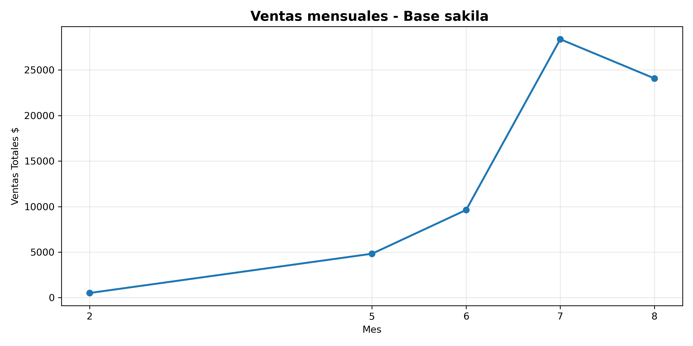

# Análisis de Ventas - Base de Datos Sakila
Proyecto Python + SQL que analiza datos de renta de películas usando la BD Sakila de MySQL.

## 🎯 Objetivo
Conectar Python con MySQL, extraer insights de ventas y clientes, y visualizar resultados.

## 🛠️ Tecnologías usadas
- *Python*: mysql-connector-python, pandas, matplotlib
- *SQL*: MySQL - Base Sakila
- *Git/GitHub*: Control de versiones + variables de entorno

## 📊 Resultados

### 1. Ventas Mensuales

*Insight*: Ventas bajas en mes 2, estables hasta mes 6, y pico máximo en mes 7 con $28,000+

### 2. Análisis de Clientes
Script consulta_clientes.py extrae Top 5 clientes que más gastaron.

## 🚀 Cómo ejecutar
1. Clona el repo
2. Crea archivo .env con tu clave MySQL:
<<<<<<< HEAD
[12:49 a.m., 17/6/2026] diego: Se pego la compu  14x
=======
[12:49 a.m., 17/6/2026] diego: Se pego la compu  14x# analisis-sakila-python-sql
>>>>>>> 7d1c763 (fix: quita timestam)
